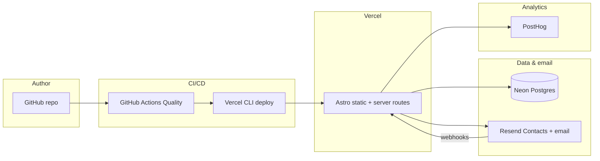

# Ecosystem

How external systems fit around **labdm-blog**. Arrows are logical data/control flow, not legal contracts.

## GitHub

- **Source of truth** for code and Markdown posts (`src/content/posts/`).
- **Branch protection** — see `CONTRIBUTING.md` and [[10-Operations-and-delivery]]; Linear doc _Repository bootstrap and delivery policy_ (LAB-2) described the initial setup.
- **Automation** — CodeRabbit (`.coderabbit.yaml`), Greptile (LAB-8), standard PR template.

## Vercel

- **Adapter** — `@astrojs/vercel` in `astro.config.ts`; `output: "static"` with **opt-in** `prerender: false` on server routes (e.g. API).
- **`vercel.json`** — `git.deploymentEnabled: false` so **no** automatic Git deploys from Vercel; deploys run from GitHub Actions after Quality passes.
- **Install/build** — `bun install --frozen-lockfile`, `bun run build` on Vercel-compatible build.

## Bun

- **Package manager** — `bun@1.3.11` (see `package.json`). Scripts for dev, build, newsletter maintenance, smoke test.

## Neon (Postgres)

- **Connection** — `POSTGRES_URL` (see `src/lib/neon.ts`, server env validation).
- **Migrations** — `db/migrations/*.sql` (subscribers table, lifecycle, double opt-in fields as applicable).
- **Role** — subscribers as **source of truth**; sync state and Resend contact id stored on rows; `subscriber_sync_events` for audit.

## Resend

- **Transactional** — confirmation and operational email (`RESEND_FROM_EMAIL`, `RESEND_API_KEY`).
- **Contacts API** — `newsletter:sync` / `newsletter:sync:report` scripts; optional `RESEND_CONTACTS_API_KEY`.
- **Webhooks** — `POST /api/webhooks/resend/contacts` with **Svix** verification (`RESEND_WEBHOOK_SECRET`).

## PostHog

- **Server only** — `posthog-node` in API routes (`src/lib/posthog-server.ts`, `posthog-server-tracking.ts`). The browser no longer loads the PostHog web SDK (no `array.js` / autotrack), to keep static HTML small.
- A future **client** snippet would be needed for pageview funnels, session recordings, and toolbar features.

## Linear (legacy planning)

- Project **Personal Blog** — roadmap and milestones; snapshot in [[09-Linear-migration-snapshot]]. No runtime dependency on Linear.

## Optional / future (from backlog)

- **Pagefind** — static search (LAB-45).
- **Vercel Speed Insights** (LAB-46).
- **Engagement** — view counts, reactions (M6) — Neon or edge (LAB-47, LAB-48, LAB-49).
