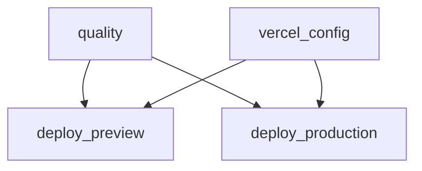

# CI/CD pipeline (reference)

Source: `.github/workflows/ci.yml` (workflow `CI`), `vercel.json`, `package.json` scripts.

**Triggers**

- `pull_request` (any branch target).
- `push` to `refs/heads/main` only (not other branches).

**Global**

- `permissions: contents: read` at workflow level (jobs that need `deployments: write` or `pull-requests: write` declare it on the job).
- `env.FORCE_JAVASCRIPT_ACTIONS_TO_NODE24: "true"` — forces GitHub’s Node-based actions (e.g. `actions/github-script`) to a Node 24–compatible runtime.

---

## Job graph (execution order)



- **Always** on every trigger: `quality` and `vercel_config` run **in parallel** (no `needs` between them).
- `**deploy_preview`: runs only if the `if:` on that job passes (see below). `needs: [quality, vercel_config]`.
- `**deploy_production`\*\*: runs only if its `if:` passes. `needs: [quality, vercel_config]`.

Preview and production **never** run on the same event: preview is PR-only, production is `push` to `main` only.

---

## Job 1: `quality` (name: “Quality”)

**Runner:** `ubuntu-latest`.

**Environment:** `ASTRO_TELEMETRY_DISABLED: "1"`.

| Step | Action      | Exact command / behavior                                                                                                                                                                 |
| ---- | ----------- | ---------------------------------------------------------------------------------------------------------------------------------------------------------------------------------------- |
| 1    | Checkout    | `actions/checkout@v6`                                                                                                                                                                    |
| 2    | Node 24     | `actions/setup-node@v6` with `node-version: 24`                                                                                                                                          |
| 3    | Bun 1.3.11  | `oven-sh/setup-bun@v2.2.0` with `bun-version: "1.3.11"`                                                                                                                                  |
| 4    | Cache       | `actions/cache@v5` on `~/.bun/install/cache`, key `bun.lock`                                                                                                                             |
| 5    | Install     | `bun install --frozen-lockfile`                                                                                                                                                          |
| 6    | Format      | `bun run format:check` → Prettier check                                                                                                                                                  |
| 7    | Lint code   | `bun run lint:code` → ESLint                                                                                                                                                             |
| 8    | Lint styles | `bun run lint:styles` → Stylelint on `src/**/*.{astro,css}`                                                                                                                              |
| 9    | Types       | `bun run typecheck` → `astro check`                                                                                                                                                      |
| 10   | Build       | `bun run build` → Astro production build                                                                                                                                                 |
| 11   | Smoke       | `bun run smoke` → `node scripts/smoke-preview.mjs` serves built `index.html` from `dist/` or Vercel output paths and checks `package.json` → `smoke.expectedSnippets` substrings in HTML |

If any step fails, the job fails. Downstream deploy jobs are skipped because they `needs: quality` and require `needs.quality.result == 'success'`.

---

## Job 2: `vercel_config` (name: “Vercel Config”)

**Purpose:** Set job output `configured` to `true` only when all three repository secrets are non-empty.

| Secret              | Role                     |
| ------------------- | ------------------------ |
| `VERCEL_ORG_ID`     | Vercel team/org id       |
| `VERCEL_PROJECT_ID` | Vercel project id        |
| `VERCEL_TOKEN`      | Vercel API token for CLI |

**Step:** shell test — if all three are set, `echo configured=true` to `GITHUB_OUTPUT`; else `configured=false`.

No checkout; no install. This job never fails the workflow for missing secrets; it only gates deploy jobs.

---

## Job 3: `deploy_preview` (name: “Vercel Preview”)

`**if` (all must be true):

1. `github.event_name == 'pull_request'`
2. `needs.quality.result == 'success'`
3. `needs.vercel_config.outputs.configured == 'true'`

`**needs`: `quality`, `vercel_config`.

**Concurrency:** `group: vercel-preview-${{ github.event.pull_request.number }}`, `cancel-in-progress: true` — new commits on the same PR cancel an in-flight preview deploy.

**Permissions:** `contents: read`, `deployments: write`, `pull-requests: write` (for PR body update and GitHub Deployment API).

**Env:** `VERCEL_ORG_ID`, `VERCEL_PROJECT_ID`, `VERCEL_TOKEN` from secrets; `ASTRO_TELEMETRY_DISABLED: "1"`.

| Step                                 | What it does                                                                                                                                                                      |
| ------------------------------------ | --------------------------------------------------------------------------------------------------------------------------------------------------------------------------------- |
| Checkout                             | `actions/checkout@v6`                                                                                                                                                             |
| Setup Node 24 + Bun 1.3.11 + cache   | Same pattern as `quality`                                                                                                                                                         |
| Install                              | `bun install --frozen-lockfile`                                                                                                                                                   |
| `vercel pull`                        | `bunx vercel pull --yes --environment=preview --token="$VERCEL_TOKEN"` — downloads project settings and env for **preview** into `.vercel/`.                                      |
| `vercel build`                       | `bunx vercel build --token="$VERCEL_TOKEN"` — produces build output under `.vercel/output` (prebuilt for next step).                                                              |
| Create GitHub Deployment             | `actions/github-script@v8` — `octokit.repos.createDeployment` for `environment: 'preview'`, `ref: pull_request.head.sha`, `transient_environment: true`. Output: `deployment_id`. |
| Mark deployment in progress          | Custom action `.github/actions/report-deployment-status` with `state: in_progress` (`continue-on-error: true`).                                                                   |
| Deploy                               | `bunx vercel deploy --prebuilt --yes --token="$VERCEL_TOKEN"` — deploys the **prebuilt** artifacts; stdout must be an `https://` URL or step fails.                               |
| Report success / failure / cancelled | `report-deployment-status` with `success` + `environment-url` from deploy URL, or `failure` on fail/cancel.                                                                       |
| Step summary                         | Appends “Preview URL” to `$GITHUB_STEP_SUMMARY`.                                                                                                                                  |
| Update PR body                       | `github-script` injects or replaces a block between `<!-- vercel-preview-start -->` and `<!-- vercel-preview-end -->` with a link to the preview. `continue-on-error: true`.      |

**When this job does not run:** push to `main`, PRs when Quality failed, or when Vercel secrets are missing.

---

## Job 4: `deploy_production` (name: “Vercel Production”)

`**if` (all must be true):

1. `github.event_name == 'push'`
2. `github.ref == 'refs/heads/main'`
3. `needs.quality.result == 'success'`
4. `needs.vercel_config.outputs.configured == 'true'`

`**needs`: `quality`, `vercel_config`.

**Concurrency:** `group: vercel-production-main`, `cancel-in-progress: false` — two production deploys do not cancel each other.

**Permissions:** `contents: read`, `deployments: write`.

| Step                                 | What it does                                                                                                                                                                                                                                          |
| ------------------------------------ | ----------------------------------------------------------------------------------------------------------------------------------------------------------------------------------------------------------------------------------------------------- |
| Checkout, Node, Bun, cache, install  | Same as preview                                                                                                                                                                                                                                       |
| Resolve production URL               | `bun -e "import { siteConfig } from './src/config/site.ts'; console.log(siteConfig.url)"` — must be `https://...` (matches `src/config/site.ts` → `siteConfig.url`, currently `https://blog.labdm.dev`). Used as GitHub Deployment `environment-url`. |
| `vercel pull`                        | `bunx vercel pull --yes --environment=production --token="$VERCEL_TOKEN"`                                                                                                                                                                             |
| `vercel build`                       | `bunx vercel build --prod --token="$VERCEL_TOKEN"`                                                                                                                                                                                                    |
| Create GitHub Deployment             | `environment: 'production'`, `production_environment: true`, `ref: context.sha`                                                                                                                                                                       |
| Mark in progress                     | `report-deployment-status`                                                                                                                                                                                                                            |
| Deploy                               | `bunx vercel deploy --prebuilt --prod --token="$VERCEL_TOKEN"` (note: **no** URL capture from stdout in workflow; success URL is the `siteConfig.url` from the earlier step).                                                                         |
| Report success / failure / cancelled | Same pattern as preview, with `environment-url: ${{ steps.production_site_url.outputs.production_site_url }}`                                                                                                                                         |

---

## Relationship to `vercel.json`

`vercel.json` sets:

- `"git": { "deploymentEnabled": false }` — **Vercel’s own Git integration does not** create deployments on push. All production/preview deploys in this setup go through **GitHub Actions** + Vercel CLI as above.
- `installCommand` / `buildCommand` — used when Vercel **does** a build (CLI `vercel build` uses project settings); local CI uses explicit `bun` commands in the workflow.
- `devCommand` — `bun run dev` (Astro dev server); used when you run `**vercel dev` locally so the CLI does not recurse into another `vercel dev` (the `dev` script must stay framework-only).
- `regions` — e.g. `["iad1"]` (Washington, D.C.) to align serverless routes with Neon in **AWS `us-east-1`** and cut database RTT.

---

## Secret matrix (summary)

| Secret present?          | `vercel_config`    | `deploy_*`                                   |
| ------------------------ | ------------------ | -------------------------------------------- |
| All three Vercel secrets | `configured=true`  | Run after Quality success (if event matches) |
| Any missing              | `configured=false` | **Skipped** — Quality still runs             |

---

## Related local commands (not CI)

For parity with what CI runs before push:

```bash
bun install --frozen-lockfile
bun run format:check
bun run lint
bun run typecheck
bun run build
bun run smoke
```

(`bun run verify:push` in `package.json` is an alias for this stack.)

---

## See also

- [[04-Architecture]] — route vs static split in this repo.
- [[07-Newsletter-subscriber-flows]] — product flows (deploy does not run newsletter sync scripts).
