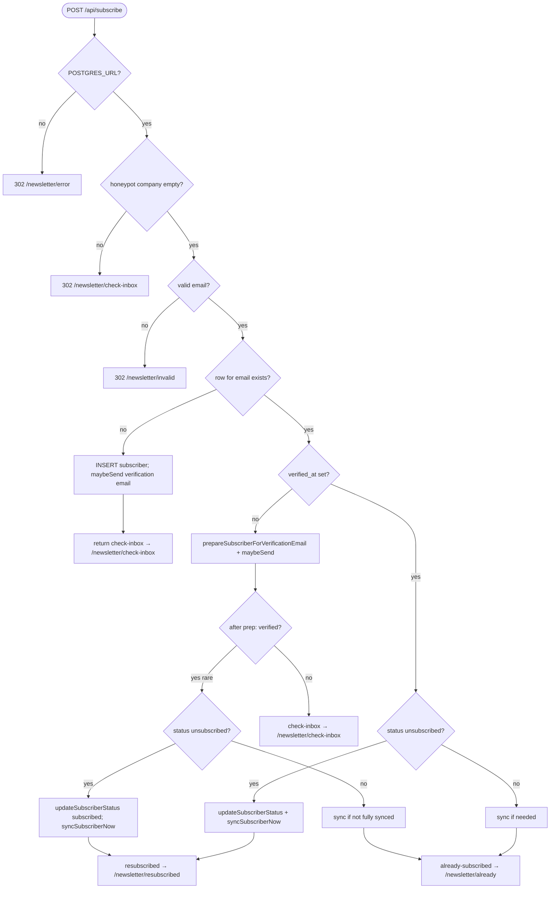
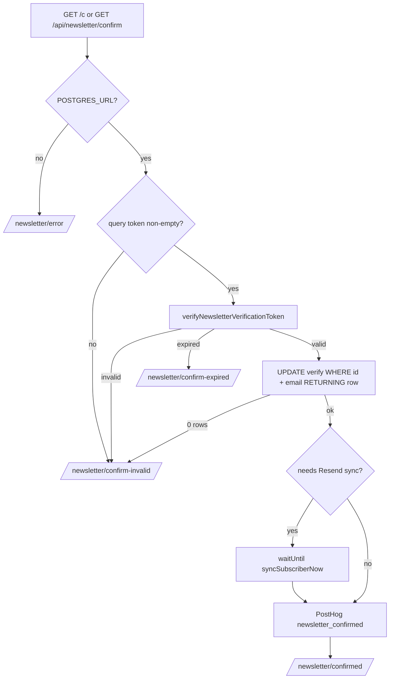
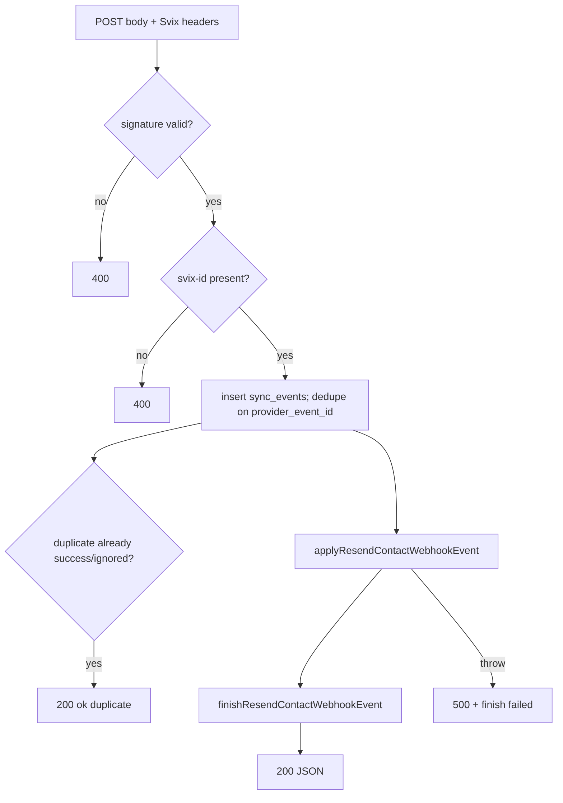

# Newsletter subscriber flows (reference)

This document matches **current** behavior in the repo (paths relative to project root):

- `src/lib/newsletter.ts` — business logic, Neon queries, Resend API, webhook application.
- `src/lib/newsletter-verification-token.ts` — HMAC-signed confirmation tokens (24h lifetime).
- `src/lib/newsletter-manage-token.ts` — manage-link tokens (used by `getNewsletterManageView` / `getSubscriberFromManageToken`).
- API routes: `src/pages/api/subscribe.ts`, `src/pages/api/newsletter/confirm.ts`, `src/pages/api/newsletter/manage.ts`, `src/pages/api/webhooks/resend/contacts.ts`, `src/pages/c.ts`.
- UI: `src/components/SubscribeForm.astro`, `src/pages/newsletter/manage/[token].astro`, `src/pages/newsletter/[state].astro`.

**Data model (Neon, table `subscribers`)**

- **Identity:** `id` (UUID), `email` (citext, unique).
- **Double opt-in:** `verified_at` — `NULL` until the user hits a valid confirmation link; migration `003` backfills old rows to treat legacy rows as verified.
- **List membership:** `status` ∈ `subscribed` | `unsubscribed`; `consent` bool kept aligned in updates.
- **Resend sync:** `sync_status` ∈ `pending` | `synced` | `failed`; `resend_contact_id`; `sync_requested_at`, `last_synced_at`, `last_sync_error`, `sync_attempt_count`. Only **verified** rows are eligible for outbound sync and for most webhook updates (see below).
- **Rate limit on verification email:** `verification_email_sent_at` — used with `reserveVerificationEmailSendAttempt` (5 minute cooldown between sends for the same unverified row).
- **Audit:** `subscriber_sync_events` — inbound webhook and outbound sync attempts (dedupe on `provider_event_id` for Svix id).

---

## A. Intake: `POST /api/subscribe`

**File:** `src/pages/api/subscribe.ts` — `prerender = false`.

**Request:** `Content-Type` must be `application/x-www-form-urlencoded` or `multipart/form-data`. Fields:

- `email` — required string.
- `company` — honeypot; if non-empty after trim, treated as bot → still redirected to a benign success page (no error to attacker).

**Preconditions**

- `POSTGRES_URL` must be configured (`src/lib/neon.ts` — `isDatabaseConfigured()`). If not → `302` → `/newsletter/error`.
- Invalid content type → `/newsletter/invalid`.
- `formData` parse error → `/newsletter/invalid`.
- Invalid or empty email (after `normalizeNewsletterEmail` + regex in `isValidNewsletterEmail`) → `/newsletter/invalid`.

**Core logic:** `subscribeNewsletterEmail(email)` in `src/lib/newsletter.ts` (returns `check-inbox` | `already-subscribed` | `resubscribed`).

**Redirects and PostHog server events (on success path before redirect)**

| Result from `subscribeNewsletterEmail` | PostHog event (if server PostHog enabled) | HTTP                               |
| -------------------------------------- | ----------------------------------------- | ---------------------------------- |
| `check-inbox`                          | `newsletter_subscribed`                   | `302` → `/newsletter/check-inbox`  |
| `already-subscribed`                   | `newsletter_subscribe_already_subscribed` | `302` → `/newsletter/already`      |
| `resubscribed`                         | `newsletter_resubscribed`                 | `302` → `/newsletter/resubscribed` |

**Throws from `subscribeNewsletterEmail`:** caught → `302` → `/newsletter/error`, exception captured for PostHog.

**Non-blocking side effects:** After a successful `subscribeNewsletterEmail`, the handler schedules `**waitUntil(runNewsletterSubscribeSideEffects(result, subscriber))`** so **verification email** (with DB reservation) and **Resend sync** when applicable do not delay the `302`. PostHog subscribe events are captured before redirect; `**waitUntil(flushPostHogServer())`** in a `finally` block flushes the server client.

**New row creation:** `createSubscriberPendingVerification` inserts `status = subscribed`, `verified_at` still null until confirm step; verification email is sent from `**runNewsletterSubscribeSideEffects`** via `maybeSendNewsletterVerificationEmail` (subject to cooldown reservation).

---

## B. Double opt-in: confirm via email link

**Two entry URLs (same token):**

1. **Short link (email-friendly):** `GET /c?token=...` — `src/pages/c.ts`. If `token` missing → `redirectUncached` → `/newsletter/confirm-invalid`. Else `302` to `/api/newsletter/confirm?token=...` (URL-encoded).
2. **Long link:** `GET /api/newsletter/confirm?token=...` — `src/pages/api/newsletter/confirm.ts`.

`**GET /api/newsletter/confirm`**

- No DB → `/newsletter/error` (uncached redirect).
- Missing `token` query → `/newsletter/confirm-invalid`.
- `confirmNewsletterSubscription(token)` (`src/lib/newsletter.ts`):
  - **Token verify** (`src/lib/newsletter-verification-token.ts`):
    - Invalid signature or shape → result `invalid` → `/newsletter/confirm-invalid`.
    - `exp` in payload past `Date.now()` → `expired` (still “valid” structure) → `/newsletter/confirm-expired`. Token lifetime **24 hours** from creation.
  - **Single Neon `UPDATE`:** `applyNewsletterVerificationFromToken(subscriberId, normalizedEmail)` — matches `**id` and `email`** from the token, sets `verified_at` (and first-time verification sync fields when `verified_at` was previously null). **No matching row** → `invalid` (tampered id/email or deleted row). Repeat clicks on an already-verified row return the row **without** resetting sync metadata.
  - Returns `**subscriberForBackgroundSync`** when `status === subscribed` and Resend sync is still needed; the HTTP handler passes that to `**waitUntil(runNewsletterConfirmSideEffects(subscriber))`**, which calls `**syncSubscriberNow**` so the **redirect is not blocked** on Resend.
- Success → PostHog `newsletter_confirmed` (in handler, with timing metadata in dev/prod) → `/newsletter/confirmed`.
- Uncaught error → `/newsletter/error`.

Uses `redirectUncached` to avoid CDN caching wrong outcomes on confirmation.

---

## C. Outbound sync to Resend (not a separate product “queue” in code)

`**syncSubscriberNow(subscriber)**` (in `src/lib/newsletter.ts`)

- **Guard:** throws if `verified_at` is null (unverified must not sync).
- Resolves or creates Resend contact: `getResendContact` by id or email; `createResendContact` or `updateResendContact` with `unsubscribed` flag matching `subscriber.status`.
- On success: `markSubscriberSyncSuccess` — `resend_contact_id`, `sync_status = synced`, etc.
- On failure: `markSubscriberSyncFailure` + `subscriber_sync_events` row with `status: failed`.

**Who calls it**

- After confirm (if needed), via `**runNewsletterConfirmSideEffects`** inside `**waitUntil`** from `src/pages/api/newsletter/confirm.ts` (not inline in the redirect response path).
- Inside `subscribeNewsletterEmail` when re-subscribing a **verified** previously-unsubscribed email, or when **verified** but contact not fully synced.
- **Not** called at the end of `performNewsletterManageAction` (unsubscribe / resubscribe from manage page) — those only run `updateSubscriberStatus`, which sets `sync_status = 'pending'`. A later **batch sync** or user-driven path must run `syncPendingSubscribers`.

**Batch:** `bun run newsletter:sync` → `scripts/newsletter-sync.ts` → `syncPendingSubscribers(limit?)` which loads rows with `verified_at IS NOT NULL` and `sync_status IN ('pending','failed')` ordered by `sync_requested_at`, then calls `syncSubscriberNow` per row.

---

## D. Inbound: `POST /api/webhooks/resend/contacts`

**File:** `src/pages/api/webhooks/resend/contacts.ts`. **Svix**-signed (see `src/lib/resend.ts` — `verifyResendContactWebhook`). Responses include `**x-request-id`** for correlation.

1. Read raw body as text (failures are caught → PostHog + `400`); verify signature with headers. Failure → `400` + message.
2. Header `svix-id` required as `providerEventId`. Missing → `400`.
3. `beginResendContactWebhookEvent` — insert `subscriber_sync_events` with unique `provider_event_id`; on duplicate **23505**, if prior row already `success` or `ignored`, return `200` `{ ok: true, duplicate: true }` (idempotent). DB errors starting the event are caught → PostHog + `500`.
4. `applyResendContactWebhookEvent`:
  - Find subscriber by `event.data.id` (Resend contact id) or `event.data.email`.
  - No row → `ignored` (no DB update to subscriber).
  - Unverified subscriber → `ignored` (message explains).
  - `contact.deleted` → clear `resend_contact_id`, set `sync_status = pending`, error message, `last_webhook_at` — expect manual `newsletter:sync` to recreate contact.
  - `contact.created` / `contact.updated` → map `unsubscribed` field to local `status` / `consent` / timestamps; set `sync_status = synced`, `last_webhook_at`, etc.

1. `finishResendContactWebhookEvent` updates the event row status. Handler returns `200` JSON on success; `500` on processing error after best-effort finish with `failed`.

---

## E. Preferences: manage link (unsubscribe / resubscribe)

`**GET /newsletter/manage/:token**` — `src/pages/newsletter/manage/[token].astro` — `prerender = false`.

- `getNewsletterManageView(token)` → `null` if DB off, bad token, or email mismatch (implementation uses `src/lib/newsletter-manage-token.ts` + DB).
- If subscriber `status === subscribed` → form with `action=unsubscribe`, label “Unsubscribe”.
- If `unsubscribed` → form with `action=resubscribe`, label “Resubscribe”.
- Invalid → copy + link to `/newsletter/manage-invalid` static state page.

`**POST /api/newsletter/manage**` — `src/pages/api/newsletter/manage.ts`.

- Same content-type rules as subscribe; fields `token` (string) and `action` (`unsubscribe` | `resubscribe` only). Bad combo → `/newsletter/manage-invalid`.
- `performNewsletterManageAction`:
  - **unsubscribe:** `updateSubscriberStatus(id, 'unsubscribed')` — does **not** call `syncSubscriberNow` in the same request.
  - **resubscribe:** `updateSubscriberStatus(id, 'subscribed')` — same, only sets `sync_status` to `pending` for later sync.
- PostHog: `newsletter_unsubscribed` or `newsletter_resubscribed_via_manage` (note event name).
- Redirect: `/newsletter/unsubscribed` or `/newsletter/resubscribed`.

**Implication:** After manage actions, Resend may be out of date until `syncPendingSubscribers` runs or another code path calls `syncSubscriberNow`.

---

## F. Static outcome pages

`src/pages/newsletter/[state].astro` — prerendered paths: `check-inbox`, `already`, `invalid`, `error`, `confirmed`, `confirm-invalid`, `confirm-expired`, `resubscribed`, `unsubscribed`, `manage-invalid` (titles/messages in `getStaticPaths`).

These are **destinations** for the `302` responses above, not API endpoints.

---

## G. Quick reference: HTTP → page

| Outcome                        | Browser lands on              |
| ------------------------------ | ----------------------------- |
| Need to confirm email          | `/newsletter/check-inbox`     |
| Already on list (verified)     | `/newsletter/already`         |
| Re-subscribed from form flow   | `/newsletter/resubscribed`    |
| Bad form / email               | `/newsletter/invalid`         |
| Server / DB error on subscribe | `/newsletter/error`           |
| Confirmed link OK              | `/newsletter/confirmed`       |
| Bad / tampered token           | `/newsletter/confirm-invalid` |
| Token past 24h                 | `/newsletter/confirm-expired` |
| Manage POST invalid            | `/newsletter/manage-invalid`  |
| Unsubscribed via manage        | `/newsletter/unsubscribed`    |
| Re-subscribed via manage       | `/newsletter/resubscribed`    |

---

## See also

- `README.md` (repo root) — env vars: `POSTGRES_URL`, `RESEND_`*, `NEWSLETTER_TOKEN_SECRET`, `RESEND_WEBHOOK_SECRET`, PostHog.
- [[06-CI-CD-pipeline]] — delivery pipeline (does not run newsletter scripts unless you add a scheduled job).

2026-04-26 22:54

07-Newsletter-subscriber-flows